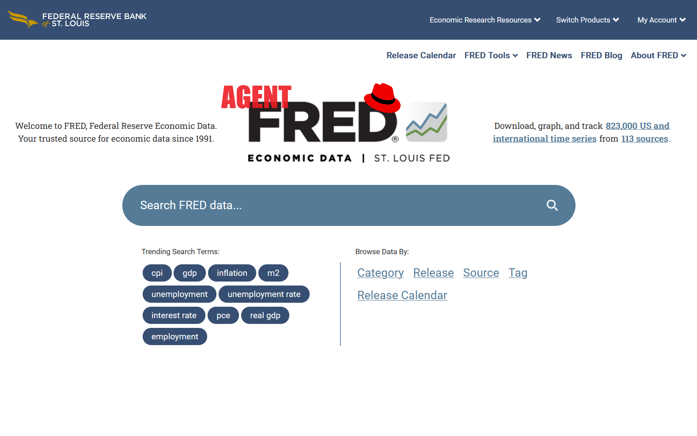

# Agent FRED

**Documentation**: [https://ChrisPappalardo.github.io/agent_fred](https://ChrisPappalardo.github.io/agent_fred)

**Source Code**: [https://github.com/ChrisPappalardo/agent_fred](https://github.com/ChrisPappalardo/agent_fred)

---

[](https://fred.stlouisfed.org/)

Agentic LLM interface for [Federal Reserve Economic Data](https://fred.stlouisfed.org/) ("FRED") using a locally-hosted open-source Large Language Model.

FRED is hosted and maintained by the [St. Louis Federal Reserve Bank](https://www.stlouisfed.org/).  Please see the [FRED Terms of Use](https://fred.stlouisfed.org/legal/#contact) for permissible use, copyright and other legal restrictions, and additional information.

## Prerequisites

This project assumes you have Linux or Windows running WSL2.  I have not tested it with macOS.  You do <u>not</u> need a GPU to run this application.

This python app requires ollama to host and serve LLM API. Select your platform and follow the [ollama installation directions](https://ollama.com/download).

You will also need to download whatever model(s) you intend to use. The default is [Microsoft's 3B phi3 LLM](https://ollama.com/library/phi3) for both the agent and chat pipelines. After installing ollama you can install phi3 with:

```sh
ollama pull phi3
```

You will need [Poetry](https://python-poetry.org/) and at least python 3.10.

## Installation

Clone this repository:

```sh
git clone https://github.com/ChrisPappalardo/agent_fred.git
```

Create a poetry shell inside the directory and install the requirements:

```sh
cd agent_fred
poetry shell
poetry install
```

## Quickstart

### Configuration

This python app uses environment variables to configure the AI backend and other variables. See `src/agent_fred/config.py`.

If you use the phi3 LLM you don't need to set anything but the `FRED_API_KEY`, which you can obtain [here](https://fred.stlouisfed.org/docs/api/api_key.html):

```sh
export FRED_API_KEY=1234
```

You can also set your config environment in `.env` in the project root:

```sh
FRED_API_KEY=123
```

The configurable options are as follows:
- `FRED_API_KEY` API key to use when making calls to the FRED
- `FRED_LLM` LLM to use with Agent FRED (default=`phi3`)
- `FRED_TEMPERATURE` verbosity of the model (default=`0.0`)

### Run

Agent FRED has both a command-line interface and a web application.

To use the web application (recommended):

```sh
python app.py
```

Navigate to [http://127.0.0.1:7860](http://127.0.0.1:7860) to view the app:


You can also use the CLI, which returns API results in JSON:

```sh
python src/agent_fred/chat.py
```


### Usage

It typically helps to have an understanding of the [data available](https://fred.stlouisfed.org/docs/api/fred/series_search.html) from the FRED API.

An example script you can use to test the application:

- `What data is available from the FRED?`
- `What is GDP and how is it calculated?`
- `What was GDP from 2000-01-01 through 2023-12-31?`
- `Why did it dip in 2020?`


In the web app you can clear the LLM's memory and start a new Q&A session with the `Clear` button.

Enjoy!

## Testing

If you're developing with Agent FRED, you can run the unit tests using the `Makefile` like so:

```sh
make test
```

You can run the linters using pre-commit:

```sh
make pre-commit
```

## Documentation

The documentation is automatically generated from the content of the [docs directory](https://github.com/ChrisPappalardo/agent_fred/tree/master/docs) and from the docstrings
 of the public signatures of the source code. The documentation is updated and published as a [Github Pages page](https://pages.github.com/) automatically as part each release.

---
